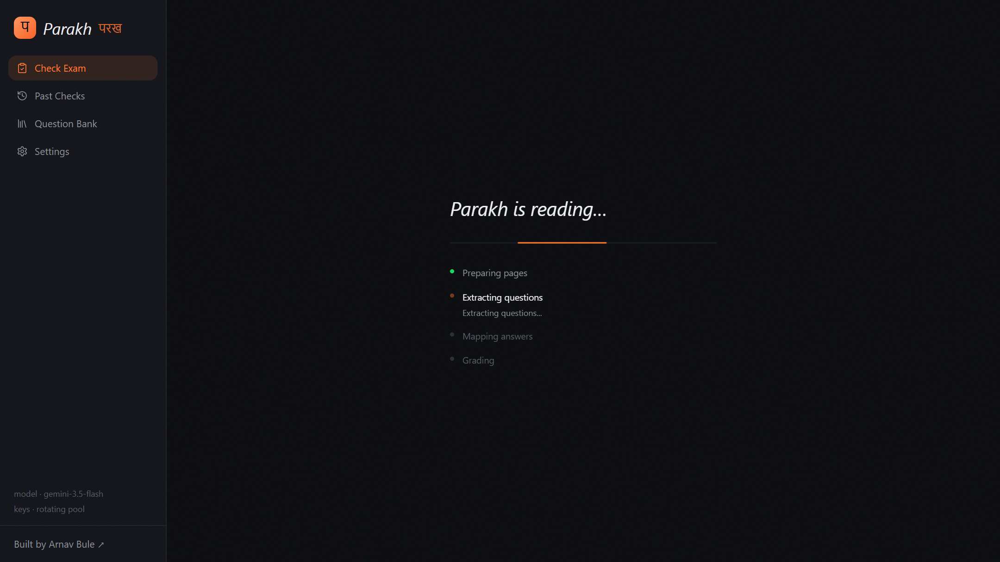

# Parakh · परख

*Upload a question paper and a handwritten answer sheet. Every answer found, highlighted and graded.*

**Parakh** — परख, Hindi for *to assess, to discern* — is a serverless exam checker. Give it a question
paper and a student's answer sheet and it extracts every question, locates each answer on the
sheet, outlines the exact ink region, scores it, and writes per-question and overall feedback. A
teacher sees at a glance what was answered, where, and what was missed.

Live at **[www.arnavbule.in/parakh](https://www.arnavbule.in/parakh)** · Source at
[github.com/GODOSTROYER/parakh](https://github.com/GODOSTROYER/parakh)


*Upload — question paper, answer sheet, and an optional marking scheme. A sample exam is one click away.*


*Reading — a step timeline tracks page preparation, question extraction, answer mapping and grading.*


*Results — select a question and its answer is outlined on the sheet, with score and feedback alongside.*

## How it works

```
Browser (pdf.js)                        Vercel functions (Gemini)
─────────────────                       ─────────────────────────
PDF → page JPEGs + text layer   ──►     /api/questions
                                          question paper text (or page images)
                                          → every question in printed order,
                                            sub-parts split, marks, OR-groups
                                        /api/grade
answer page JPEGs               ──►       one multimodal call: reads the
                                          handwriting, maps answers to
                                          questions with bounding boxes,
                                          grades (diagrams included), feedback
results + highlights            ◄──       structured JSON (response schema)
```

- **Rendering happens in the browser.** pdf.js rasterises each page to a compact JPEG and pulls
  the text layer where one exists. The backend never receives the original file.
- **Two routes, no state.** `/api/questions` structures the paper; `/api/grade` reads the answer
  pages in a single multimodal call and returns schema-constrained JSON. There is no database,
  no object storage and no GPU.
- **Highlights follow the ink.** Gemini returns a bounding box per answer as
  `[ymin, xmin, ymax, xmax]` on a 0–1000 grid, so overlays stay tight at any zoom.
- **Models.** `gemini-3.5-flash` is primary, with `gemini-3.5-flash-lite` as the fallback.
- **Free-tier key rotation.** `GEMINI_API_KEYS` accepts any number of comma-separated keys. Every
  call round-robins across them, and on a quota error advances through keys × models before
  failing, pooling several free quotas into one.

## Edge cases

| Case | Behaviour |
|---|---|
| Sub-parts (`11 (a)`, `Q1 part 2`, `1 (ii)`, `2.1`) | Separate entries; printed numbering preserved |
| OR / optional questions | Both alternatives extracted; the skipped one shows "OR · skipped"; the choice set counts once in the total |
| Answers out of order | Mapped by the student's own numbering, with content as fallback |
| Answer spans pages | One highlight per page, auto-scroll to the first |
| Unanswered questions | Flagged, scored 0 |
| Stray writing | Listed under "Unmatched answers", highlightable |
| Diagrams | Graded visually (structure and labels) |
| Marking scheme (optional third upload) | Grading follows its criteria |

## Design

The interface is a dark, editorial take on mission control: quiet surfaces, precise type, and
one warm accent.

- **Typography.** Instrument Serif for display and the italic wordmark; Instrument Sans for body;
  Geist Mono for numbers, labels and file metadata; Tiro Devanagari Hindi for the परख accents and
  the brand mark.
- **Surfaces.** Hairline borders (`rgba(255,255,255,0.08)`) instead of shadows, and a subtle SVG
  fractal-noise grain over the page ground.
- **Colour.** Saffron `#FF7A2F` is the only brand colour and is used sparingly: the wordmark,
  the primary action, focus rings, the active step. Scores use semantic colours — green for full
  marks, amber for partial, rose for unanswered, sky for an OR alternative the student skipped.
- **Motion.** Short enter transitions, a pulsing active-step dot and a thin indeterminate bar;
  all of it collapses under `prefers-reduced-motion`.

## Live URL

The canonical address is **https://www.arnavbule.in/parakh**. The app is served under the
portfolio domain through a proxy (Next.js `basePath: "/parakh"`), and every other URL — the
`vercel.app` deployment and any subdomain — redirects there.

## Run locally

```bash
npm install
echo GEMINI_API_KEYS=key1,key2 > .env.local
npm run dev
```

Open **http://localhost:3000/parakh** — the `/parakh` path is required because the app is built
with that `basePath`. Sample files live in `fixtures/` (a synthetic paper exercising every edge
case) and `Test Data/`; the upload screen can also load a sample exam directly.

| Env var | Default | Purpose |
|---|---|---|
| `GEMINI_API_KEYS` | — (required) | Comma-separated Gemini API keys, rotated per call |
| `GEMINI_MODELS` | `gemini-3.5-flash,gemini-3.5-flash-lite` | Model ladder; the first is primary |

## Stack

Next.js 15 · Tailwind v4 · pdfjs-dist (client-side rendering) · Gemini API with structured
output · Vercel. No auth, no database — results live in the browser session and are gone on
refresh.

## Limitations

- Free-tier quotas bound throughput. Heavy use rotates through keys and falls back to
  flash-lite before failing loudly.
- Results are per-session by design; nothing is stored server-side.
- Maximum 15 pages per document and roughly 10 MB per file.
- Grading quality is that of the model: dense or faint handwriting and unusual numbering can
  still produce mismatches, which is why every highlight is inspectable.

---

An earlier local-GPU variant (DeepSeek-OCR-2 + Codex CLI) is preserved at the
`vedaai-deepseek-submission` git tag.

Built by [Arnav Bule](https://www.arnavbule.in).
