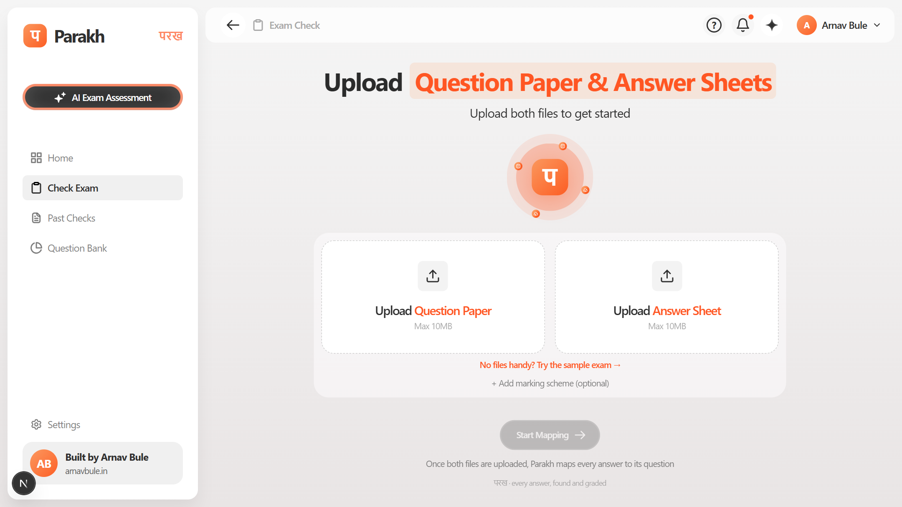
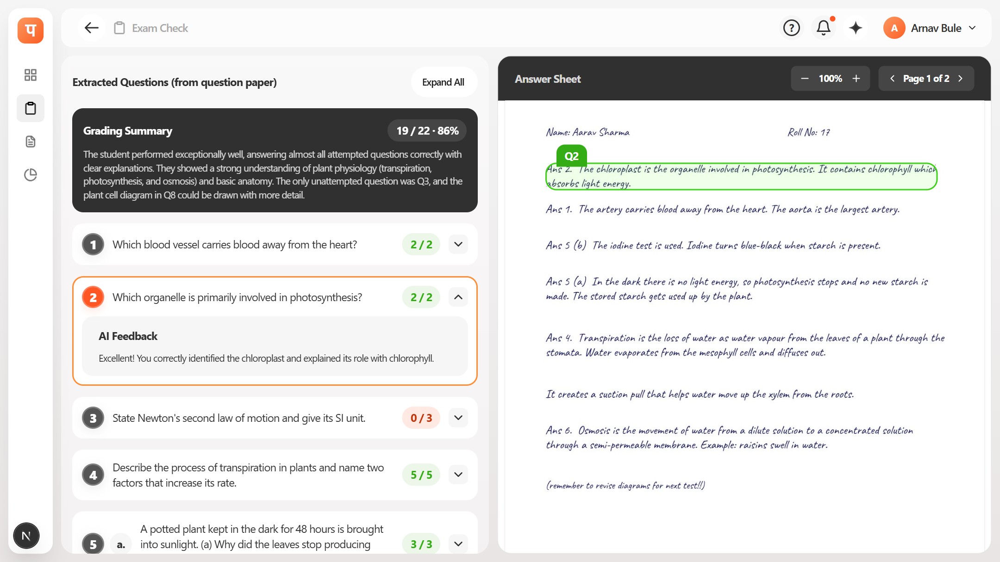

# Parakh · परख — AI Exam Assessment

**परख** (Hindi: *to assess, to discern*) checks a student's exam in one upload: give it a
**question paper** and a **handwritten answer sheet**, and it extracts every question, finds
each answer on the sheet, **highlights the exact ink region**, grades it, and writes
per-question and overall feedback — so a teacher instantly sees *what was answered, where,
and what was missed*.





## How it works — fully serverless

```
Browser (pdf.js)                        Vercel functions (Gemini)
─────────────────                       ─────────────────────────
PDF → page JPEGs + text layer   ──►     /api/questions
                                          question paper text (or page images)
                                          → every question, printed order,
                                            sub-parts split, marks, OR-groups
                                        /api/grade
answer page JPEGs               ──►       one multimodal call: reads the
                                          handwriting, maps answers to
                                          questions with bounding boxes,
                                          grades (diagrams included), feedback
results + highlights            ◄──       ← structured JSON (response schema)
```

- Pages are rendered **in the browser** (pdf.js) — the backend only ever receives compact
  JPEGs, there is no server-side storage, no database, no GPU.
- **Gemini** reads the handwriting and returns tight bounding boxes (`[ymin,xmin,ymax,xmax]`
  0–1000) per answer, so highlights follow the exact ink at any zoom.
- **Free-tier key rotation**: `GEMINI_API_KEYS` takes any number of comma-separated keys;
  every call round-robins and advances across keys × models (`gemini-3.5-flash` →
  `gemini-3.5-flash-lite`) on quota errors, pooling several free quotas into one.

### Handles the messy reality of exam scripts

| Case | Behaviour |
|---|---|
| Sub-parts (`11 (a)`, `Q1 part 2`, `1 (ii)`, `2.1`) | Separate entries, printed numbering preserved |
| OR / optional questions | Both alternatives extracted; skipped one shows "OR — skipped"; the choice-set counts once in the total |
| Answers out of order | Mapped by the student's own numbering, content as fallback |
| Answer spans pages | One highlight per page, auto-scroll to the first |
| Unanswered questions | Flagged red, scored 0 |
| Stray writing | Listed under "Unmatched answers", highlightable |
| Diagrams | Graded visually (structure + labels) |
| Marking scheme (optional third upload) | Grading follows its criteria |

## Stack

Next.js 15 · Tailwind v4 · pdfjs-dist (client-side rendering) · Gemini API with structured
output · deployed on Vercel. No auth, no database — results live in the browser session.

> The original local-GPU variant of this project (DeepSeek-OCR-2 on an RTX 4060 +
> GPT-5.6 Luna via Codex CLI) is preserved at the `vedaai-deepseek-submission` tag.

## Run locally

```bash
npm install
echo GEMINI_API_KEYS=key1,key2 > .env.local
npm run dev
```

Sample files in `fixtures/` (synthetic paper exercising every edge case) and `Test Data/`.

| Env var | Default | |
|---|---|---|
| `GEMINI_API_KEYS` | — (required) | Comma-separated Gemini API keys, rotated per call |
| `GEMINI_MODELS` | `gemini-3.5-flash,gemini-3.5-flash-lite` | Model ladder, first is primary |

## Limitations

- Free-tier quotas bound throughput; heavy use rotates through keys and falls back to
  flash-lite before failing loudly.
- Results are per-session (refresh clears them) — by design, nothing is stored.
- Max 15 pages per document, ~10MB per file.

---

Built by [Arnav Bule](https://www.arnavbule.in).
